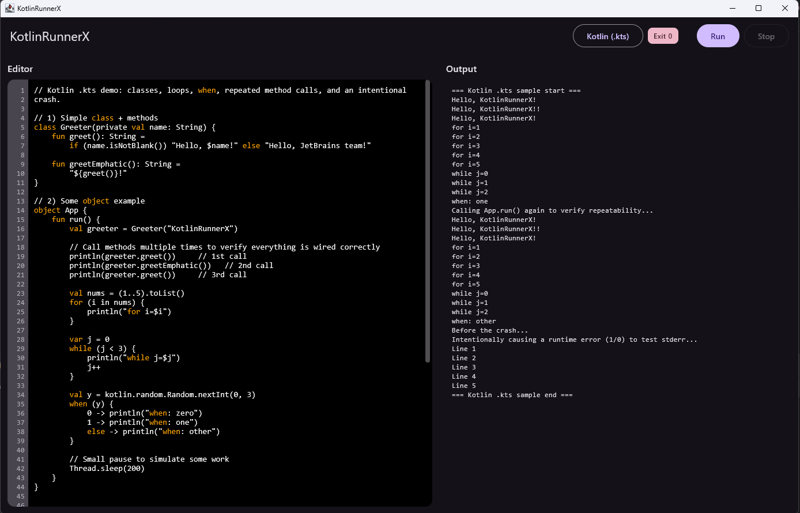

# KotlinRunnerX — simple Kotlin **.kts** runner with live output

KotlinRunnerX is a tiny desktop GUI (Compose Multiplatform for Desktop) that lets you paste/write a **Kotlin script (.kts)**, run it with the real compiler (`kotlinc -script`), and see **live stdout/stderr** side-by-side. It shows running state, exit code, a timer, line numbers, **keyword highlighting**, and **clickable error locations** that jump you to the exact line/column in the editor.    
    
**Video presentation of the application working can be found in the project, named "video_presentation"**.

    

> ✅ Built to match the task requirements:
> - Editor pane + output pane
> - Writes the script to a file and runs it via **`kotlinc -script script.kts`**
> - Streams **live output** (stdout & stderr, different colors)
> - Shows **running** indicator and **exit code** of last run
> - **Keyword highlighting** for ~10 Kotlin keywords
> - **Clickable** error locations (e.g. `script.kts:2:1: error: ...`) that move the scroll to that place

---

## ✨ Features

- **Editor**
    - Modern editor with **line numbers (gutter)**
    - Lightweight Kotlin **keyword highlighting** (`fun, class, object, val, var, if, else, when, for, while, return, import, package`)
    - Click on an error in the output to **jump to line/column** in the editor
    - Custom scrollbar & shared scroll between gutter and editor
- **Runner**
    - Executes real `.kts` using **`kotlinc -script`** (****not just an embedded interpreter***)
    - Streams stdout/stderr **line-by-line** in realtime
    - **Stop** button that cancels the whole **process tree**
    - **Status chip** (Idle / Running / Exit 0 / Exit ≠0) and a **timer** chip
- **Output**
    - Colors: stdout = normal; stderr = error color
    - Detects both **compile-time** (`script.kts:LINE:COL: error:`) and **runtime stacktrace** locations (`(script.kts:LINE)`)
    - Makes locations **clickable**; selection is enabled for non-clickable lines

---

## 🧱 Project layout (packages)
org.example/        
├── Main.kt     
├── application/        
│   ├── Application.kt      
│   ├── EditorPane.kt       
│   └── OutputPane.kt       
├── kotlin_syntax/      
│   └── KotlinSyntaxHighlighter.kt      
├── runner/     
│   ├── ScriptRunner.kt     
│   └── RunInstance.kt      
├── script/     
│   └── sampleKotlinScript.kt       
└── utils/      
├── OutputLine.kt   
└── RunStatus.kt        

---

## ⚙️ Prerequisites

- **JDK 17+** (recommended)
- **Gradle** 
- **Kotlin compiler (kotlinc)** installed on your system and is in your PATH
- The compiler must include scripting jars (`kotlin-scripting-…`, `kotlin-script-runtime`, optionally `kotlin-main-kts`).
    - On Windows the app auto-probes the compiler’s nearby `lib`, `KOTLIN_HOME\lib`, or `C:\Program Files\Kotlinc\lib`.

---

## ▶️ Build & Run
**IntelliJ IDEA (recommended)**

1. Clone the project
2. Open the project.
2. Make sure the JDK 17 is selected for the Gradle JVM.
3. ***Run the run Gradle task or the main() in Main.kt.***

   - You can use the following command:     
   `./gradlew clean run`

---

## 🧪 Try it out yourself

1. Start the app — the editor is prefilled with a demo .kts on path: **/script/SampleKotlinScript.kt** (you can add any kotlin code)

2. Click **Run**.

3. Watch live output appear on the right.

4. Introduce a compile error (e.g., val s: String = 123) → click Run → an error like
script.kts:XX:YY: error: ... will appear. Click the underlined location to jump there.

5. For runtime errors, you’ll see stacktrace frames like (script.kts:LINE) — those are clickable too.

6. Click Stop to kill long-running scripts; it cancels the entire process tree (you stop it anytime).

---

## 🧰 Implementation notes

- **Writes to real files**  
Each run creates a temp directory and places the script as script.kts. This yields familiar diagnostics like script.kts:line:col, which we parse and make clickable.
    

- **Process management**  
Uses ProcessBuilder to spawn kotlinc -script, streams IO with coroutines, and on cancel uses Java 9+ ProcessHandle.descendants() to destroy the whole process tree (graceful, then destroyForcibly() as a fallback).

    
- **Clickable errors**    
Output pane searches each line with two regexes:
    
  - **Compile time**: script.kts:(\d+):(\d+):\s+error

  - **Runtime frames**: \(script\.kts:(\d+)\)

  - **Matching ranges** are styled and annotated; ClickableText dispatches clicks to onNavigateTo(line, col), which positions the caret and scrolls the editor to bring the line into view.

    
- **Keyword highlighting**    
A minimal VisualTransformation colors a handful of keywords using a boundary-aware regex. This is intentionally basic (doesn’t avoid strings/comments) to match the task’s “simple is fine” guidance.

---
## 🛠 Troubleshooting

**Failed to start `kotlinc`**  
Ensure the Kotlin compiler is installed and visible in `PATH`.

**Unresolved references like `println`**  
Usually means the scripting **classpath** wasn’t found. On Windows, the app auto-probes common `lib` folders and builds `-cp` with needed jars. If your install is custom, set `KOTLIN_HOME` or pass `-Dkotlinc.path` to a standard install.

**macOS/Linux**  
Note: this app was not tested on macOS, but it should work. If not, there is a video demonstrating how the app works.  
Ensure `kotlinc` is installed and on `PATH`.    
The code is cross-platform; only the Windows classpath probing path is special.

---

### 🧩 How to change the code for your needs

**Change highlighted keywords**  
Edit `kotlin_syntax/KotlinSyntaxHighlighter.kt` — adjust the keyword list and (optionally) the color.

**Adjust error regexes**  
See `application/OutputPane.kt` — update the two `Regex` patterns if needed.

**Swap initial sample**  
`script/sampleKotlinScript.kt` holds the default script shown on startup.

---

## 🚧 Known limitations

- The syntax highlighter is deliberately lightweight; it may color keywords inside strings/comments.
- Click-to-navigate relies on the file being named `script.kts` (the app creates it with that name on purpose).
- Swift mode isn’t included in this build (UI is ready but not wired).

---

## 📜 License

Use freely for review/demonstration purposes.

---

## ❤️ Credits

Built with **Compose Multiplatform for Desktop**.  
Thanks to the Kotlin team for scripting support.
